# 📐 Algorithmic Trading System - Architecture Design Document

## 1. System Overview

### High-Level Architecture

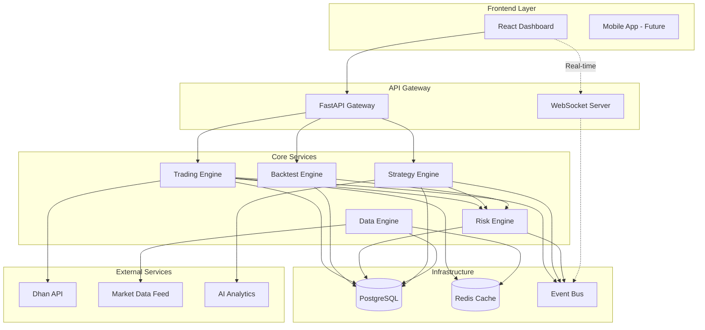

## 2. Clean Architecture Layers

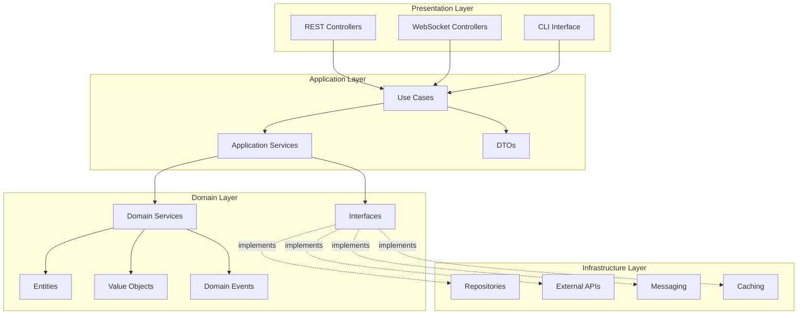

## 3. Trading Flow Sequence

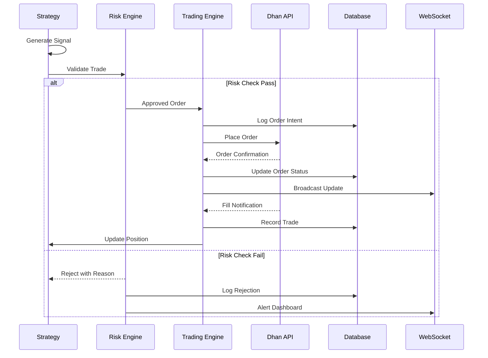

## 4. Database Schema

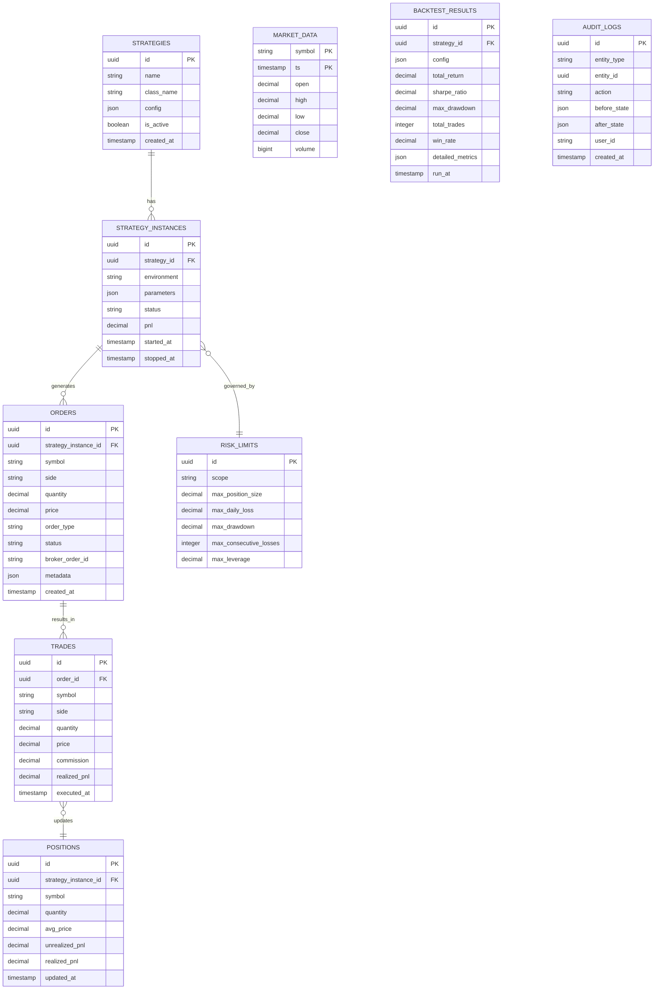

## 5. Risk Management Flow

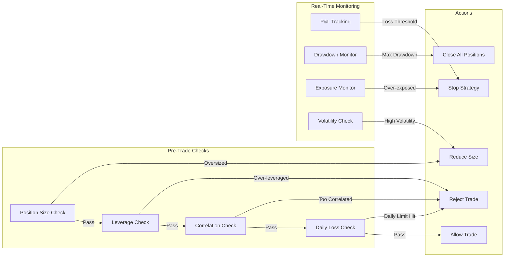

## 6. Component Interaction

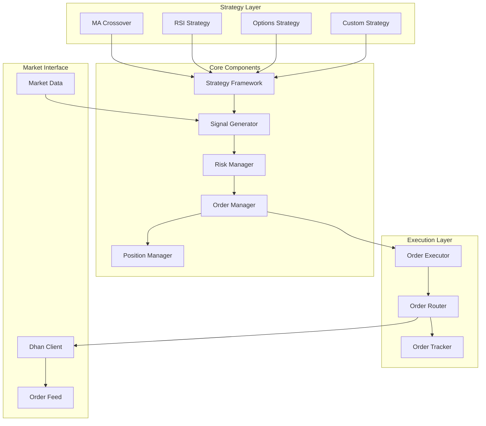

## 7. Event-Driven Architecture

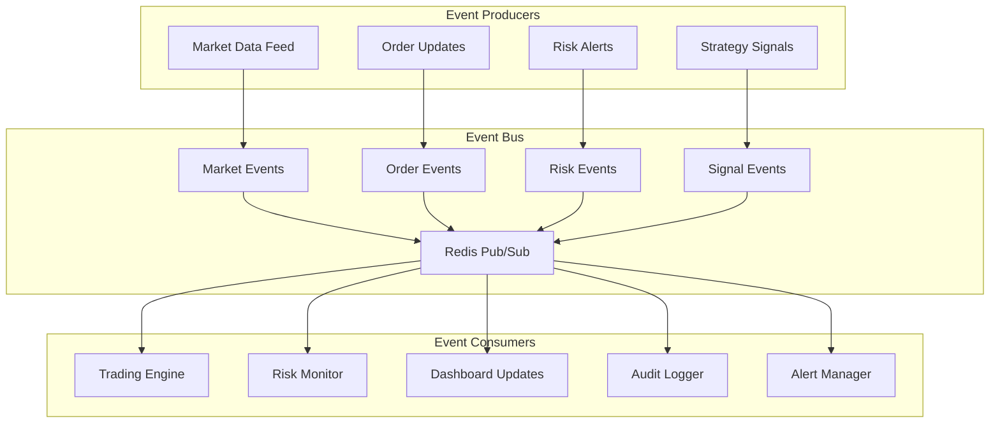

## 8. Order State Machine

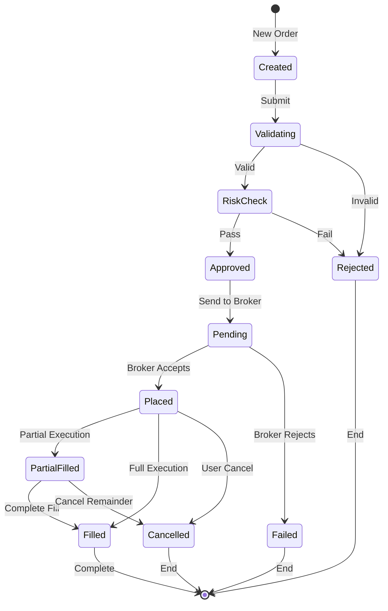

## 9. Deployment Architecture

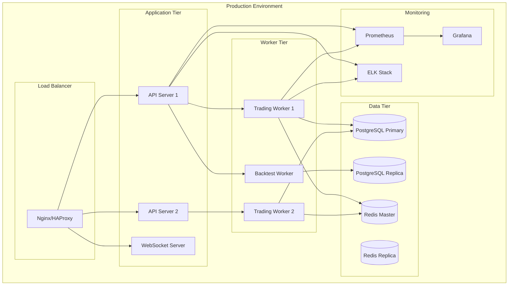

## 10. Strategy Class Hierarchy

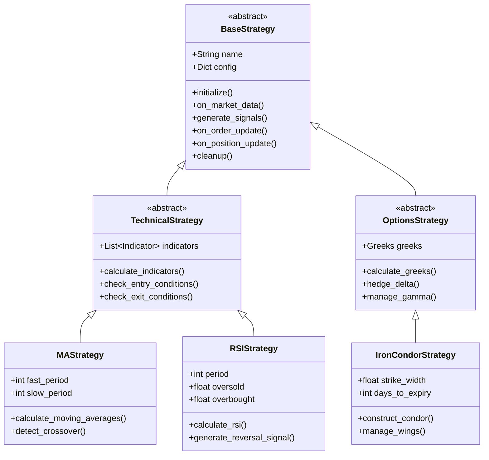

## 11. Data Pipeline Architecture

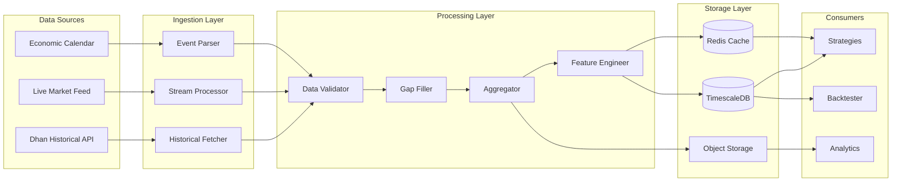

## 12. Safety and Circuit Breaker Architecture

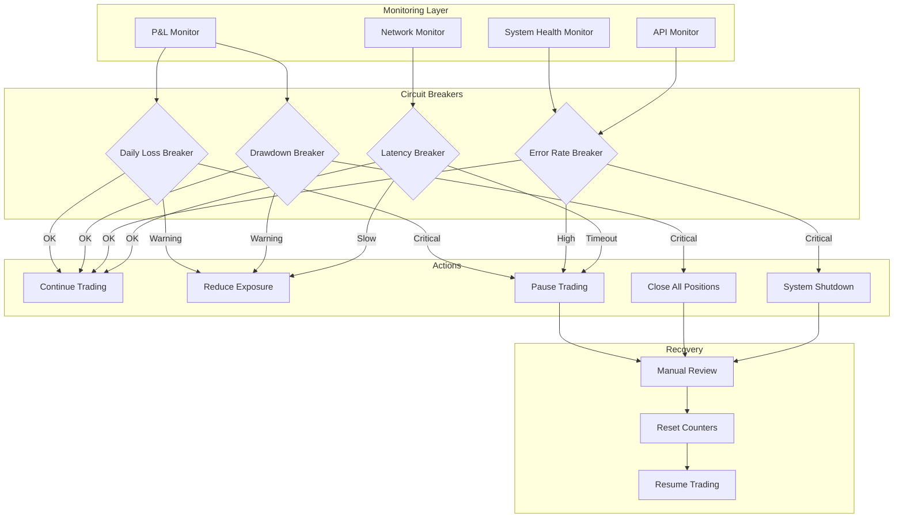

## 13. API Gateway Pattern

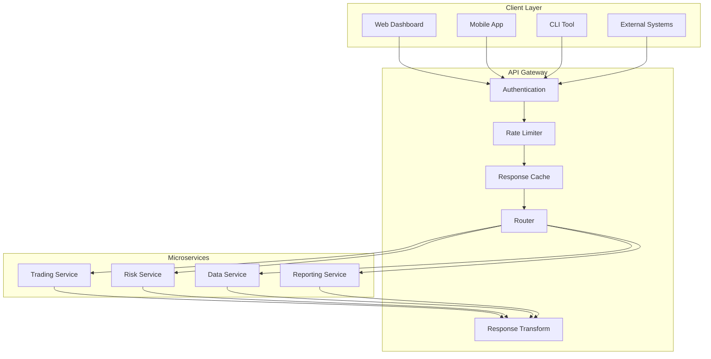

## 14. Backtesting Engine Flow

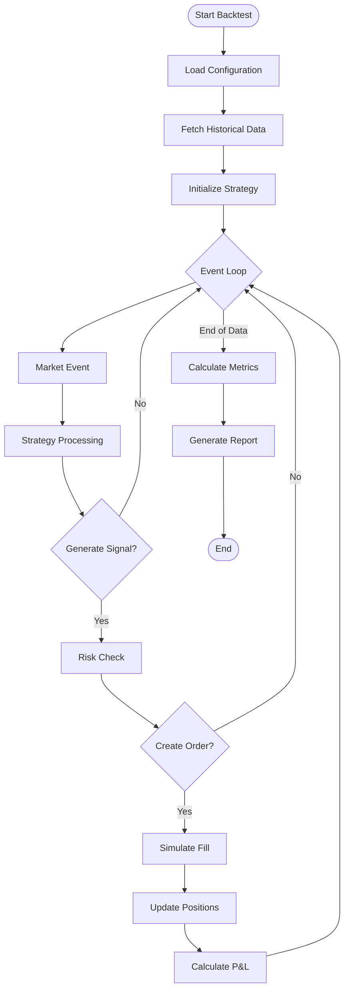

## 15. Environment Configuration Flow

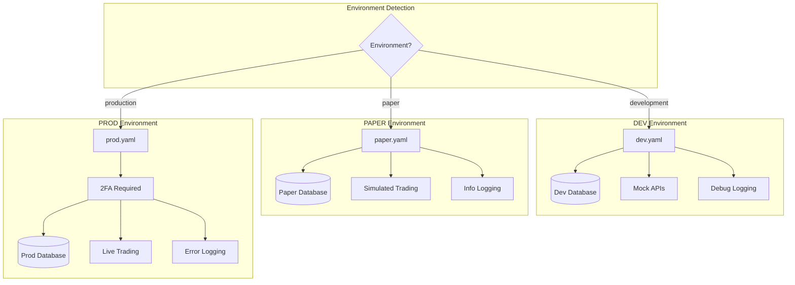

---

## 📊 Key Design Decisions

### 1. **Clean Architecture**
- Ensures business logic is independent of frameworks
- Makes testing easier with clear boundaries
- Allows swapping implementations without affecting core

### 2. **Event-Driven Design**
- Enables real-time updates across components
- Provides natural audit trail
- Supports horizontal scaling

### 3. **Multi-Layer Risk Management**
- Pre-trade validation prevents bad orders
- Real-time monitoring catches developing issues
- Circuit breakers provide automatic safety stops

### 4. **Strategy Plugin System**
- New strategies can be added without modifying core
- Each strategy runs in isolation
- Strategies can be tested independently

### 5. **Comprehensive Observability**
- Every action is logged with correlation IDs
- Metrics exported for monitoring
- Full audit trail for compliance

## 🔐 Security Considerations

1. **API Security**
   - JWT tokens with refresh mechanism
   - Rate limiting per user/IP
   - Input validation at every layer

2. **Data Protection**
   - Encryption at rest for sensitive data
   - TLS for all network communication
   - Secrets managed via environment variables

3. **Access Control**
   - Role-based permissions (Viewer, Trader, Admin)
   - Audit logs for all actions
   - 2FA for production access

## 🎯 Performance Targets

- **Order Latency**: < 100ms from signal to broker
- **Backtest Speed**: 100,000 candles/second
- **Dashboard Updates**: < 500ms real-time latency
- **System Recovery**: < 30 seconds after crash
- **Data Ingestion**: 1M candles/minute

## 🛠️ Technology Stack

### Backend
- **Language**: Python 3.13
- **Framework**: FastAPI
- **ORM**: SQLAlchemy 2.0
- **Async**: asyncio + uvloop
- **Task Queue**: Celery with Redis
- **WebSocket**: FastAPI WebSocket + Redis Pub/Sub

### Database
- **Primary**: PostgreSQL 16 with TimescaleDB
- **Cache**: Redis 7
- **Time Series**: TimescaleDB for market data
- **Message Queue**: Redis Streams

### Frontend
- **Framework**: React 18 with TypeScript
- **State Management**: Zustand
- **Charts**: TradingView Lightweight Charts
- **UI Components**: Ant Design Pro
- **Real-time**: Socket.io client

### Infrastructure
- **Container**: Docker + Docker Compose
- **Orchestration**: Kubernetes (production)
- **Monitoring**: Prometheus + Grafana
- **Logging**: ELK Stack (Elasticsearch, Logstash, Kibana)
- **Tracing**: Jaeger
- **CI/CD**: GitHub Actions

### External Services
- **Trading API**: Dhan API
- **Market Data**: Dhan WebSocket
- **AI/ML**: OpenAI API for insights
- **Notifications**: Slack + Email (SendGrid)

## 📁 Project Structure

```
algo-trading-system/
├── backend/
│   ├── domain/
│   │   ├── entities/
│   │   │   ├── __init__.py
│   │   │   ├── order.py
│   │   │   ├── trade.py
│   │   │   ├── position.py
│   │   │   └── strategy.py
│   │   ├── value_objects/
│   │   │   ├── __init__.py
│   │   │   ├── money.py
│   │   │   ├── symbol.py
│   │   │   └── order_type.py
│   │   ├── interfaces/
│   │   │   ├── __init__.py
│   │   │   ├── repository.py
│   │   │   ├── broker.py
│   │   │   └── market_data.py
│   │   └── events/
│   │       ├── __init__.py
│   │       ├── order_events.py
│   │       └── trade_events.py
│   ├── application/
│   │   ├── use_cases/
│   │   │   ├── __init__.py
│   │   │   ├── place_order.py
│   │   │   ├── run_backtest.py
│   │   │   └── manage_strategy.py
│   │   ├── services/
│   │   │   ├── __init__.py
│   │   │   ├── trading_service.py
│   │   │   ├── risk_service.py
│   │   │   └── strategy_service.py
│   │   └── dto/
│   │       ├── __init__.py
│   │       ├── order_dto.py
│   │       └── strategy_dto.py
│   ├── infrastructure/
│   │   ├── dhan/
│   │   │   ├── __init__.py
│   │   │   ├── client.py
│   │   │   ├── websocket.py
│   │   │   └── mapper.py
│   │   ├── database/
│   │   │   ├── __init__.py
│   │   │   ├── models.py
│   │   │   ├── repositories.py
│   │   │   └── session.py
│   │   ├── messaging/
│   │   │   ├── __init__.py
│   │   │   ├── event_bus.py
│   │   │   └── redis_pubsub.py
│   │   └── monitoring/
│   │       ├── __init__.py
│   │       ├── logger.py
│   │       ├── metrics.py
│   │       └── tracer.py
│   ├── interfaces/
│   │   ├── api/
│   │   │   ├── __init__.py
│   │   │   ├── main.py
│   │   │   ├── routers/
│   │   │   │   ├── strategies.py
│   │   │   │   ├── orders.py
│   │   │   │   ├── backtest.py
│   │   │   │   └── metrics.py
│   │   │   └── middleware/
│   │   │       ├── auth.py
│   │   │       ├── rate_limit.py
│   │   │       └── error_handler.py
│   │   ├── websocket/
│   │   │   ├── __init__.py
│   │   │   ├── server.py
│   │   │   └── handlers.py
│   │   └── cli/
│   │       ├── __init__.py
│   │       └── commands.py
│   ├── strategies/
│   │   ├── base/
│   │   │   ├── __init__.py
│   │   │   ├── strategy.py
│   │   │   └── indicators.py
│   │   ├── builtin/
│   │   │   ├── __init__.py
│   │   │   ├── ma_crossover.py
│   │   │   ├── rsi_strategy.py
│   │   │   └── iron_condor.py
│   │   └── custom/
│   │       └── __init__.py
│   ├── engines/
│   │   ├── backtest/
│   │   │   ├── __init__.py
│   │   │   ├── engine.py
│   │   │   ├── simulator.py
│   │   │   └── metrics.py
│   │   ├── live/
│   │   │   ├── __init__.py
│   │   │   ├── engine.py
│   │   │   ├── executor.py
│   │   │   └── monitor.py
│   │   └── paper/
│   │       ├── __init__.py
│   │       └── engine.py
│   ├── risk/
│   │   ├── validators/
│   │   │   ├── __init__.py
│   │   │   ├── position_size.py
│   │   │   ├── leverage.py
│   │   │   └── correlation.py
│   │   ├── limits/
│   │   │   ├── __init__.py
│   │   │   ├── daily_loss.py
│   │   │   └── drawdown.py
│   │   └── monitors/
│   │       ├── __init__.py
│   │       ├── real_time.py
│   │       └── circuit_breaker.py
│   └── tests/
│       ├── unit/
│       ├── integration/
│       └── e2e/
├── frontend/
│   ├── src/
│   │   ├── components/
│   │   │   ├── Dashboard/
│   │   │   ├── StrategyControl/
│   │   │   ├── TradeHistory/
│   │   │   ├── Charts/
│   │   │   └── RiskMonitor/
│   │   ├── pages/
│   │   │   ├── Home.tsx
│   │   │   ├── Strategies.tsx
│   │   │   ├── Backtest.tsx
│   │   │   └── Reports.tsx
│   │   ├── services/
│   │   │   ├── api.ts
│   │   │   ├── websocket.ts
│   │   │   └── auth.ts
│   │   ├── stores/
│   │   │   ├── tradingStore.ts
│   │   │   ├── strategyStore.ts
│   │   │   └── uiStore.ts
│   │   └── utils/
│   │       ├── formatters.ts
│   │       └── validators.ts
│   ├── public/
│   └── package.json
├── database/
│   ├── migrations/
│   │   └── alembic/
│   └── schemas/
│       └── init.sql
├── configs/
│   ├── dev.yaml
│   ├── paper.yaml
│   ├── prod.yaml
│   └── logging.yaml
├── scripts/
│   ├── setup.sh
│   ├── backtest.py
│   ├── deploy/
│   │   ├── build.sh
│   │   └── deploy.sh
│   └── data/
│       └── fetch_historical.py
├── docker/
│   ├── Dockerfile.backend
│   ├── Dockerfile.frontend
│   ├── docker-compose.yaml
│   └── docker-compose.prod.yaml
├── docs/
│   ├── API.md
│   ├── STRATEGIES.md
│   ├── DEPLOYMENT.md
│   └── TROUBLESHOOTING.md
├── .env.example
├── .gitignore
├── README.md
├── pyproject.toml
└── requirements.txt
```

## 🚀 Implementation Roadmap

### Phase 1: Foundation (Week 1)
- [ ] Set up project structure
- [ ] Configure development environment
- [ ] Implement domain entities
- [ ] Set up PostgreSQL with TimescaleDB
- [ ] Create Dhan API client wrapper
- [ ] Implement logging framework

### Phase 2: Core Engine (Week 2)
- [ ] Build strategy framework
- [ ] Implement backtesting engine
- [ ] Create risk validators
- [ ] Build data ingestion pipeline
- [ ] Develop sample strategies

### Phase 3: Live Trading (Week 3)
- [ ] Implement live trading engine
- [ ] Build order management system
- [ ] Add position tracking
- [ ] Create paper trading mode
- [ ] Implement safety controls

### Phase 4: APIs & Dashboard (Week 4)
- [ ] Develop FastAPI backend
- [ ] Create React dashboard
- [ ] Implement WebSocket server
- [ ] Build charts and visualizations
- [ ] Add strategy control panel

### Phase 5: Production Ready (Week 5)
- [ ] Add AI insights module
- [ ] Implement monitoring
- [ ] Create comprehensive tests
- [ ] Write documentation
- [ ] Deploy to production

## 🔍 Critical Safety Checklist

### Pre-Production
- [ ] All risk validators tested
- [ ] Circuit breakers configured
- [ ] Kill switch tested
- [ ] Paper trading validated
- [ ] Backtest results verified

### Production Deployment
- [ ] Environment variables secured
- [ ] 2FA enabled for production
- [ ] Database backups configured
- [ ] Monitoring alerts active
- [ ] Disaster recovery plan tested

### Operational Safety
- [ ] Daily loss limits enforced
- [ ] Position size limits active
- [ ] Duplicate order prevention tested
- [ ] Crash recovery validated
- [ ] Audit logging verified

---

## 📝 Notes

This architecture is designed for production-grade algorithmic trading with real money. Safety and observability are prioritized at every level. The system is built to fail safely - any uncertainty or error results in no trading rather than potentially incorrect trades.

The modular design allows for easy extension and modification without affecting core functionality. New strategies can be added as plugins, and the system can be scaled horizontally for increased throughput.

---

**Document Version**: 1.0.0
**Last Updated**: March 2026
**Status**: Ready for Implementation